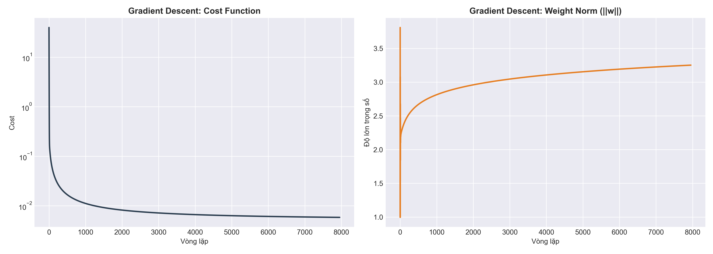
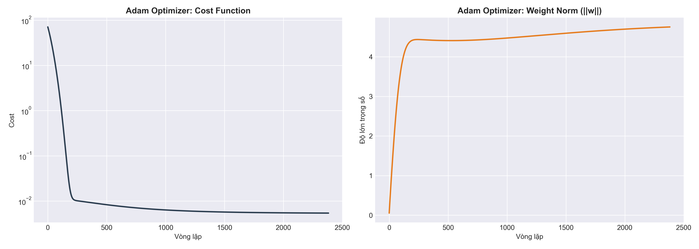
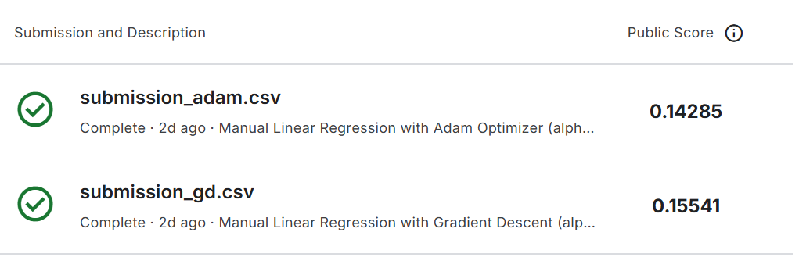
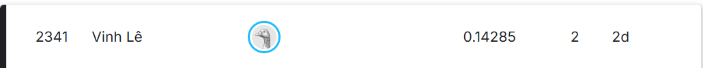

# 🏠 Dự đoán Giá nhà: So sánh Gradient Descent, Adam Optimizer & Normal Equation (From Scratch)

Dự án này triển khai mô hình **Linear Regression** hoàn toàn từ con số 0 bằng **NumPy** để dự đoán giá nhà từ bộ dữ liệu Kaggle nổi tiếng. Trọng tâm của dự án là phân tích thực nghiệm và nghiên cứu hiệu suất giữa ba thuật toán tối ưu hóa: **Gradient Descent (GD)** truyền thống, **Adam Optimizer** và **Normal Equation (OLS).

---

## 🚀 Điểm nổi bật của dự án
* **Triển khai thuần NumPy:** Toàn bộ logic mô hình và bộ tối ưu được viết bằng ma trận NumPy, không sử dụng các thư viện ML bậc cao như Scikit-learn hay TensorFlow.
* **Tiền xử lý dữ liệu (Feature Engineering):** Áp dụng Log Transformation cho biến mục tiêu, One-hot Encoding cho dữ liệu phân loại, xử lý giá trị khuyết và Standard Scaling.
* **Chống Overfitting:** Tích hợp **L2 Regularization (Ridge Regression)** để kiểm soát độ lớn trọng số, giúp mô hình bền vững hơn.
* **Đa dạng phương pháp tối ưu**: So sánh trực tiếp giữa thuật toán lặp **(GD, Adam)** và thuật toán giải trực tiếp **(Normal Equation)**
---

## 📊 Kết quả thực nghiệm (Kaggle Public Score)

Kết quả so sánh trên bài toán [House Prices Competition](https://www.kaggle.com/c/house-prices-advanced-regression-techniques) chứng minh sức mạnh của các thuật toán tối ưu hóa hiện đại:

- kết quả của Gradient Decent


- kết quả của Adam Optimizer



| Thuật toán | Loại hình | Tốc độ học ($\alpha$) | Số vòng lặp | Cost | Điểm Kaggle (RMSLE) |
| :--- | :---: | :---: | :--- | :---| :---|
| **Gradient Descent** | Iterative | $0.06$ | $7953$ | $0.005846$ | **$0.15541$** |
| **Adam Optimizer** | Iterative |$0.003$ | $2382$ | $0.005402$ | **$0.14285$** |
| **Normal Equation** | Analytical | N/A | $1$ | $0.004720$ | **$0.15002$** |

> **Nhận xét:** Bảng so sánh cho thấy sự khác biệt rõ rệt về khả năng tối ưu hóa và tính tổng quát hóa của từng thuật toán. Adam Optimizer đạt hiệu quả cao nhất trên thực tế với điểm Kaggle (RMSLE) tốt nhất là 0.14285, mặc dù mức Cost trên tập huấn luyện (0.005402) không phải là thấp nhất. Ngược lại, Normal Equation đạt mức Cost tối ưu nhất (0.004720) nhờ phương pháp giải tích trực tiếp, nhưng lại có điểm Kaggle kém hơn Adam (0.15002), minh chứng cho việc mô hình bị quá khớp (overfitting) khi cố gắng bám sát dữ liệu huấn luyện quá mức. So với Gradient Descent truyền thống, Adam thể hiện sự vượt trội hoàn toàn khi hội tụ nhanh hơn gấp 3.3 lần (chỉ cần 2382 vòng lặp so với 7953) và đạt độ chính xác cao hơn hẳn dù sử dụng tốc độ học ($\alpha$) nhỏ hơn rất nhiều. Tổng kết lại, Adam Optimizer là phương pháp cân bằng tốt nhất giữa việc giảm thiểu hàm mất mát và khả năng dự báo chính xác trên dữ liệu thực tế, trong khi Normal Equation mạnh về tốc độ tính toán nhưng đòi hỏi kiểm soát tham số $\lambda$ chặt chẽ hơn để tránh sai số trên tập kiểm tra.

---

## 🧠 Kiến thức toán học áp dụng

Dưới đây là các công thức cốt lõi được triển khai trong file `model.py` để xây dựng mô hình.

### 1. Mô hình dự báo (Linear Model)
Mô hình giả định giá nhà là tổ hợp tuyến tính của các đặc trưng đầu vào:

```math
\hat{y} = Xw + b
```
### 2. Hàm mất mát và Chính quy hóa (Cost Function & L2 Regularization)
Để đo lường sai số và kiểm soát hiện tượng quá khớp (Overfitting), chúng ta sử dụng MSE kết hợp với L2:

$$
J(w, b) = \frac{1}{2m} \sum_{i=1}^{m} \left( \hat{y}^{(i)} - y^{(i)} \right)^2 + \frac{\lambda}{2m} \sum_{j=1}^{n} w_j^2
$$

Trong đó:
* $m$: Số lượng mẫu dữ liệu.
* $\lambda$: Hệ số chính quy hóa (Regularization parameter).

### 3. Thuật toán tối ưu hóa (Optimization)
#### 3.1. Gradient Descent (GD) truyền thống
Cập nhật trọng số bằng cách di chuyển ngược hướng gradient:

$$
w = w - \alpha \frac{\partial J}{\partial w} \quad , \quad b = b - \alpha \frac{\partial J}{\partial b}
$$

#### 3.2. Adam Optimizer (Nâng cao)
Adam kết hợp cơ chế Momentum (quán tính) và RMSProp (tốc độ học thích nghi).

##### Bước 1: Cập nhật các Moment (Trung bình động):

$$
m_t = \beta_1 m_{t-1} + (1 - \beta_1) g_t
$$

$$
v_t = \beta_2 v_{t-1} + (1 - \beta_2) g_t^2
$$

##### Bước 2: Hiệu chỉnh sai số (Bias Correction):

$$
\hat{m}_t = \frac{m_t}{1 - \beta_1^t} \quad , \quad \hat{v}_t = \frac{v_t}{1 - \beta_2^t}
$$

##### Bước 3: Quy tắc cập nhật trọng số cuối cùng:

$$
w_{t+1} = w_t - \alpha \frac{\hat{m}_t}{\sqrt{\hat{v}_t} + \epsilon}
$$

Trong đó:
* $\alpha$: Tốc độ học (Learning Rate).
* $\beta_1, \beta_2$: Các hệ số phân rã (thường là $0.9$ và $0.999$).
* $\epsilon$: Số cực nhỏ để tránh lỗi chia cho 0 (thường là $10^{-8}$).
  
## 🛠 Cài đặt và Sử dụng
### 1. Clone project:
   ```bash
   git clone https://github.com/vinlee15/HousePrice-Scratch-GD-vs-Adam
   ```
### 2. Cài đặt thư viện:
   ```bash
   pip install -r requirements.txt
   ```
### 3. Chạy mô hình:
```bash
python main.py
```
## Screenshots 📸
- kết quả của 2 lần submit


- rank của bài tốt nhất (adam optimizer)


## 👨‍💻 Tác giả
Lê Quang Vinh Sinh viên năm thứ nhất chuyên ngành Công nghệ thông tin Học viện Công nghệ Bưu chính Viễn thông (PTIT) Dự án được xây dựng nhằm nghiên cứu sâu về các thuật toán tối ưu hóa trong học máy cơ bản.
   
